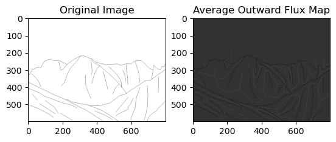

# pyMLV
Python version of the Mid-level Vision Toolbox (MLVToolbox) created by the BWLab at the University of Toronto.


 
<hr>

The Mid-level Vision Toolbox (MLVToolbox) was created by the BWLab at the University of Toronto as a tool for researchers to extract structural properties of contours such as orientation, length, curvature and junctions present in images. MLVToolbox allows researchers to quantify the presence of perceptual organization cues such as mirror symmetry, ribbon symmetry, and taper symmetry using medial axis properties of contours in naturalistic images. MLVToolbox also provides researchers with a free and easy way to extract visual statistics that underlie our experience of surfaces, objects, scenes and even works of art. It will facilitate reproducible experimental stimulus sets using built-in functions that manipulate contours in images based on one or several mid-level vision properties. In addition, MLVToolbox offers several visualization functions for tracing contour orientations, lengths, curvature, junctions, as well as, medial axis properties on computer-generated and artist-generated line drawings. A contour extraction functionality helps users obtain computer-generated line drawings from real-world photographs. To encourage researcher's exploration of its potential, we have provided several example datasets produced using the MLVToolbox.

This Python version now includes most of the functions required for demonstrations that retrieve contour features and the medial axis. The functions related to the TraceLineDrawing demo are in the final stages of testing. <br> 
*_Please stay tuned for updates!_* 

## Table of Contents
- [Requirements](#Requirements)
- [Usage](#Usage)
- [Datasets](#Datasets)
- [FAQs](#FAQs)
- [References](#References)
- [License](#License)
- [Detailed Function Documentation](https://github.com/bwlabToronto/pyMLV/blob/main/docs/index.html)

## Requirements

<!-- Write that there is a requirements.txt -->
The pyMLV toolbox requires Python packages which can be installed using the requirements.txt file. To install the required packages, run the following command in the terminal:

```pip3 install -r requirements.txt```

## Usage

The pyMLV toolbox is designed to be user-friendly and easy to use. The toolbox includes several demos that demonstrate the functionality of the toolbox. The demos are located in the `demos` folder. The demos are written in Jupyter notebooks and can be run in JupyterLab or Jupyter Notebook.

To run the demos, follow these steps:
1. Clone the repository to your local machine.
2. Navigate to the `demos` folder.
3. Open the desired demo in JupyterLab or Jupyter Notebook.
4. Run the cells in the notebook to see the results.

The demos include the following:
* [Demo_ContourFeatures](demos/getcontourfeatures_Single.ipynb): This demo shows how to extract contour features from an image, including orientation, length, curvature, and junctions.
* [Demo_MedialAxis](demos/getMedialAxis.ipynb): This demo shows how to extract the medial axis of an image and visualize it.

Note: The medial axis demo at the moment needs the imgLD from the MATLAB version due the difference in the way rendering is done in Python and MATLAB. We are working on a solution to this issue.

**Computing Medial Axis Properties**

 

Using MLV, one can compute accurate AOF-based medial axis transform (MAT) from binary images. These images can either be rendered from LineDrawing (LD) datastructures (check out renderLinedrawing.m function) or be binary images from other sources. Like the example (bunny) above shows, there are some intermediate steps in the process of extracting MAT, including the extraction of the distance map as well as the extraction of the average outward flux map (AOF). This information along with the skeleton is stored in the MAT computed from a binary image. Please see the following example of a mountain scene where the average outward flux map (AOF) is computed from the binary image. 

Output:



## Datasets

We include several data sets, alread processed as vectorized line drawings:

* [TorontoScenes](dataSets/TorontoScenes/TorontoScenes_Readme.md) data set of 475 scene images
* International Affective Picture System ([IAPS](dataSets/IAPS/IAPS_Readme.md))
* A set of 200 [Architectural Scenes](dataSets/ArchitecturalScenes/ArchitecturalScenes_Readme.md)
* The Open Affective Standardized Image Set ([OASIS](dataSets/OASIS/OASIS_Readme.md))
* The 260 line drawings of objects from [Snodgrass and Vanderwart (1980)](dataSets/Snodgrass_Vanderwart/Snodgrass_Vanderwart_Readme.md)

## FAQs

We are working on this section, please make sure to check back here in the future. As of now, please ask your questions on the discussion page of the MLV toolbox available [here](https://github.com/bwlabToronto/pyMLV/discussions). 

## References

If you use the MLV toolbox, we appreciate it if you cite the following papers as appropriate:

Walther, D. B., Farzanfar, D., Han, S., & Rezanejad, M. (2023). The mid-level vision toolbox for computing structural properties of real-world images. *Frontiers in Computer Science*, **5**. [doi: 10.3389/fcomp.2023.1140723](https://doi.org/10.3389/fcomp.2023.1140723)

Rezanejad, M., Downs, G., Wilder, J., Walther, D. B., Jepson, A., Dickinson, S., & Siddiqi, K. (2019). Scene categorization from contours: Medial axis based salience measures. In *Proceedings of the IEEE/CVF Conference on Computer Vision and Pattern Recognition* (pp. 4116-4124). [PDF](https://drive.google.com/file/d/1uEVoTjrYzdF-N0ZeR4_B8Le6N4jRtjyf/view?usp=drive_link)

Walther, D. B., & Shen, D. (2014). Nonaccidental properties underlie human categorization of complex natural scenes. *Psychological science*, **25**(4), 851-860. [PDF](https://drive.google.com/file/d/1tVlsjLdlL1mwCbFJhiZ6afGHNXO6-lf-/view?usp=drive_link)

Rezanejad, M., & Siddiqi, K. (2013). Flux graphs for 2D shape analysis (pp. 41-54). Springer London.


```
Bibtex:

@article{walther2023mid,
  title={The mid-level vision toolbox for computing structural properties of real-world images},
  author={Walther, Dirk B and Farzanfar, Delaram and Han, Seohee and Rezanejad, Morteza},
  journal={Frontiers in Computer Sciene},
  volume={5},
  year={2023},
  publisher={Frontiers}
}
@InProceedings{rezanejad2019scene,
author = {Rezanejad, Morteza and Downs, Gabriel and Wilder, John and Walther, Dirk B and Jepson, Allan and Dickinson, Sven and Siddiqi, Kaleem},
title = {Scene Categorization from Contours: Medial Axis Based Salience Measures},
booktitle = {The IEEE Conference on Computer Vision and Pattern Recognition (CVPR)},
month = {June},
year = {2019}
}
@article{walther2014nonaccidental,
  title={Nonaccidental properties underlie human categorization of complex natural scenes},
  author={Walther, Dirk B and Shen, Dandan},
  journal={Psychological science},
  volume={25},
  number={4},
  pages={851--860},
  year={2014},
  publisher={Sage Publications Sage CA: Los Angeles, CA}
}
@incollection{rezanejad2013flux,
  title={Flux graphs for 2D shape analysis},
  author={Rezanejad, Morteza and Siddiqi, Kaleem},
  booktitle={Shape Perception in Human and Computer Vision},
  pages={41--54},
  year={2013},
  publisher={Springer}
}

```

## License

The pyMLV toolbox contains various modules from different projects. Please take some time to check licenses on the released files. 


